# Cache Management — Diagram Reference

Visual companion to [cache-management-hld.md](./cache-management-hld.md). Every diagram
below reflects the implemented module in `src/cacheManagement/`.

---

## 1. System context

Where the dashboard sits relative to the two backends it talks to.

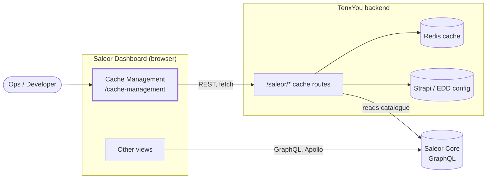

The cache module is the only part of the dashboard that speaks REST to TenxYou.
It deliberately bypasses Apollo — there is no GraphQL surface for these routes.

---

## 2. Module architecture

Three layers, one direction of dependency. Nothing below points upward.

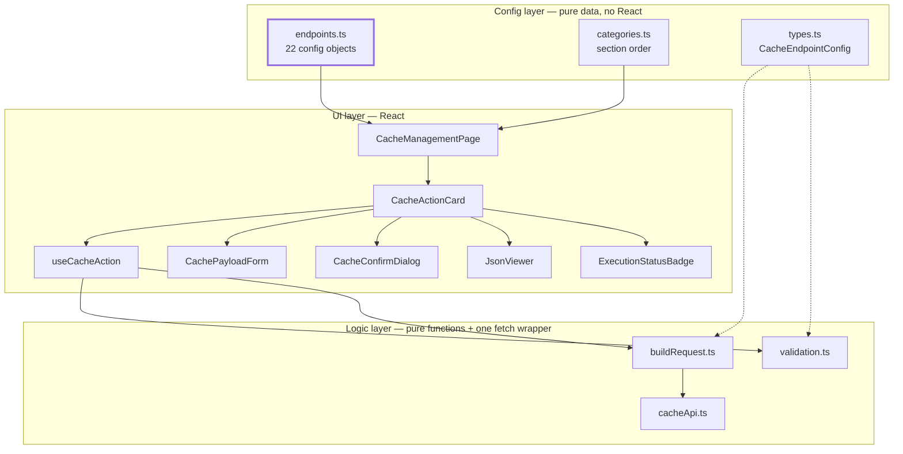

`endpoints.ts` is the single source of truth. The page derives its sections from it,
the card derives its badges and button from it, the form derives its inputs from it,
and validation derives its rules from it.

---

## 3. Component hierarchy

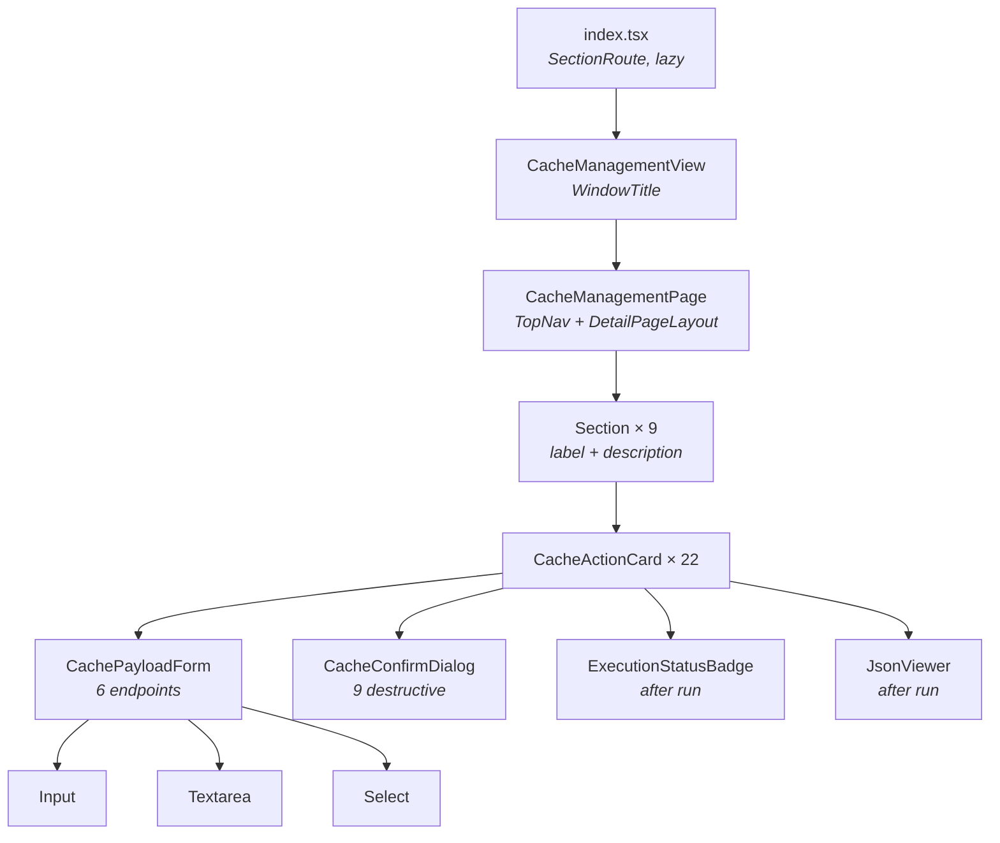

Only `CacheActionCard` knows an endpoint exists. Everything beneath it is generic over
the field schema — no component contains endpoint-specific branching.

---

## 4. Request lifecycle

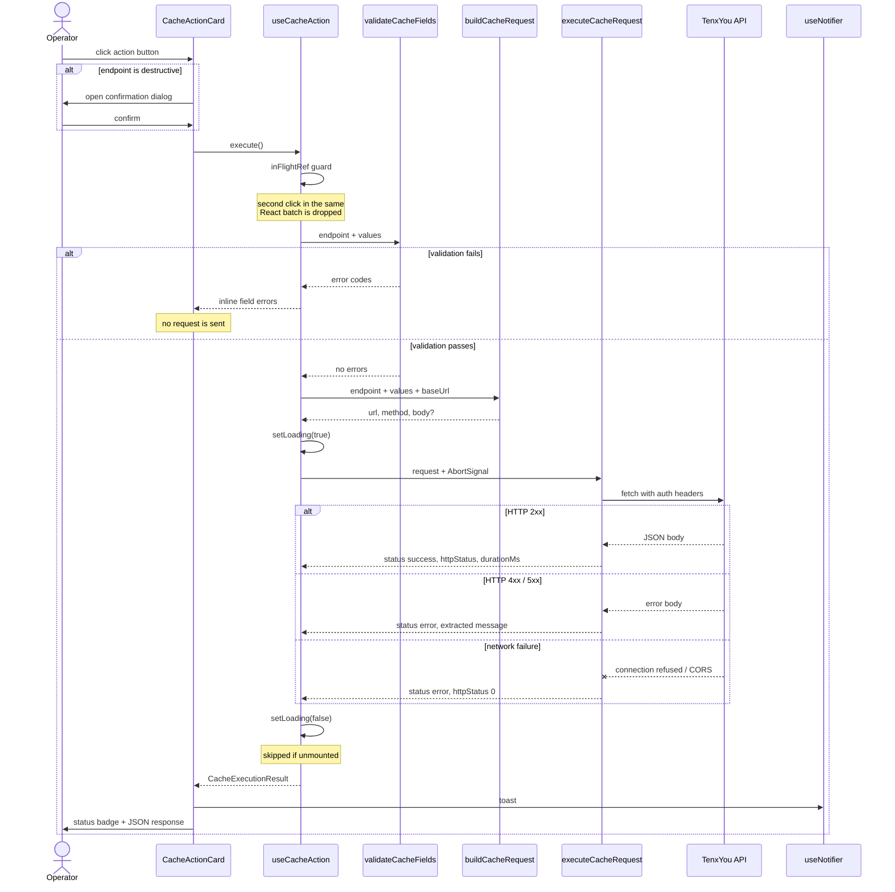

`executeCacheRequest` always resolves — a network failure is a result, not a rejection.
That gives timing, toasts and rendering exactly one code path.

---

## 5. Card state machine

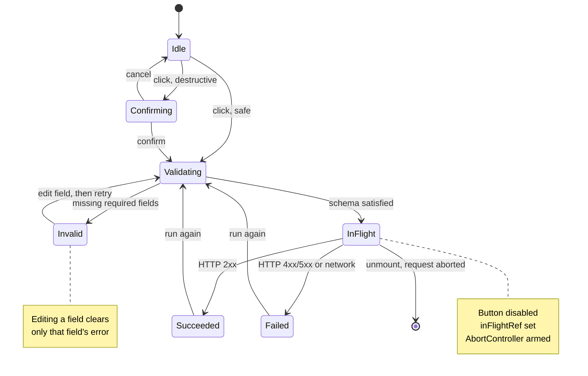

`Disabled` is a fourth resting state, entered when `VITE_TENEXU_API_URL` is unset —
the card renders with an explanation rather than a button that silently fails.

---

## 6. Payload routing

How `buildCacheRequest` decides where a field's value goes. This is the branch that
made the abstraction worth building — three shapes exist across the 22 endpoints.

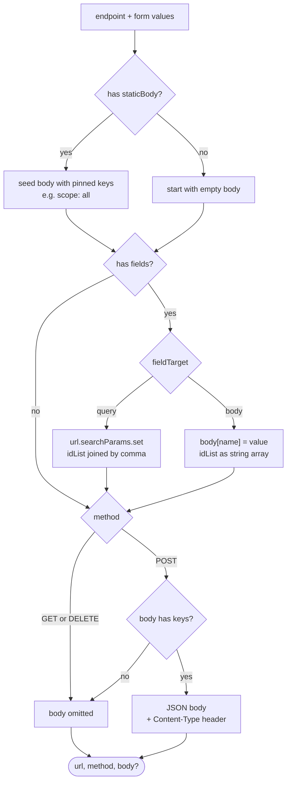

Blank and whitespace-only values are skipped rather than sent as empty strings, so a
half-filled optional field never reaches the backend.

---

## 7. Endpoint taxonomy

Grouped by payload shape rather than by section — this is the axis that drives the code.

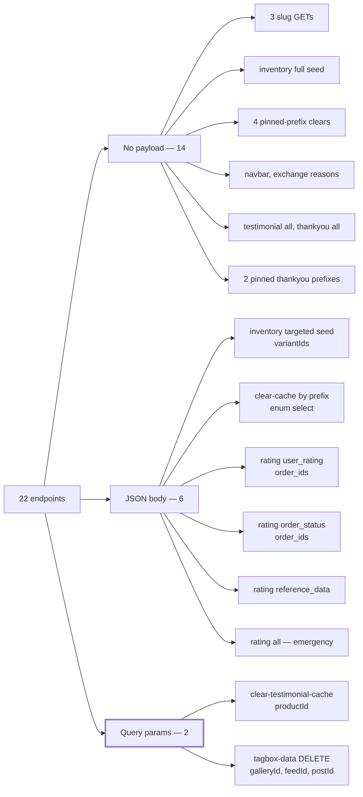

The two query-param endpoints are the reason the form layer was built target-aware from
the start. Had it assumed JSON bodies, both would have needed a retrofit — and
`tagbox-data` is the only `DELETE` in the collection.

---

## 8. Authorisation

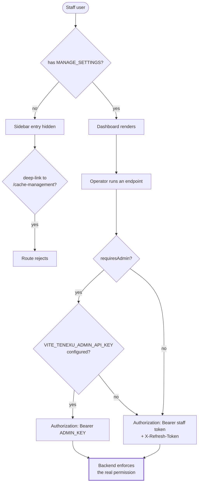

The permission is checked twice — sidebar and route — so a deep link fails the same way
as a hidden menu item. Client-side gating is convenience; the backend stays the
authority on every route.

---

## 9. Error handling

Every failure mode collapses into one result shape before it reaches the UI.

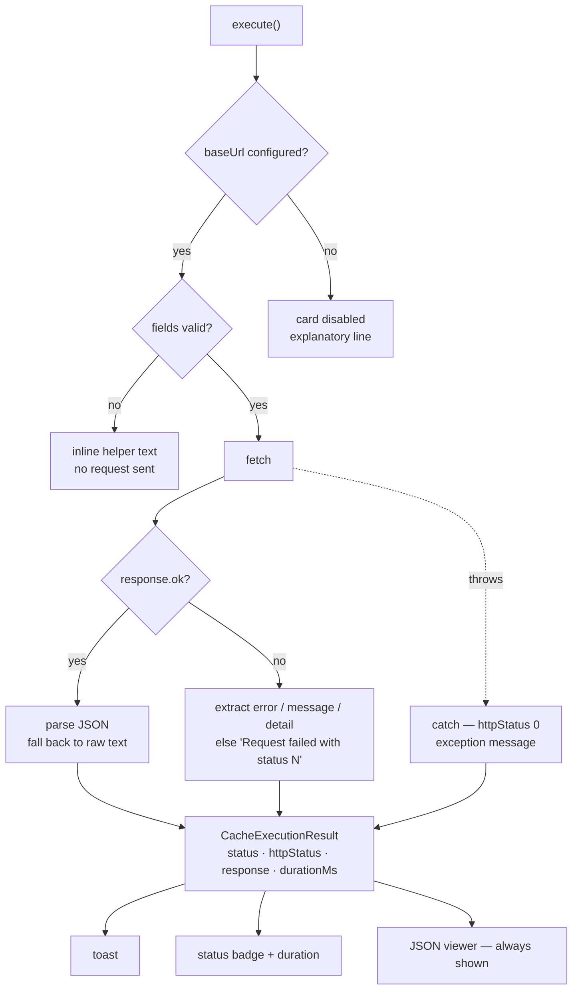

The raw response body is rendered whatever happens, so an unrecognised error shape is
still diagnosable without opening dev tools.

---

## 10. Type model

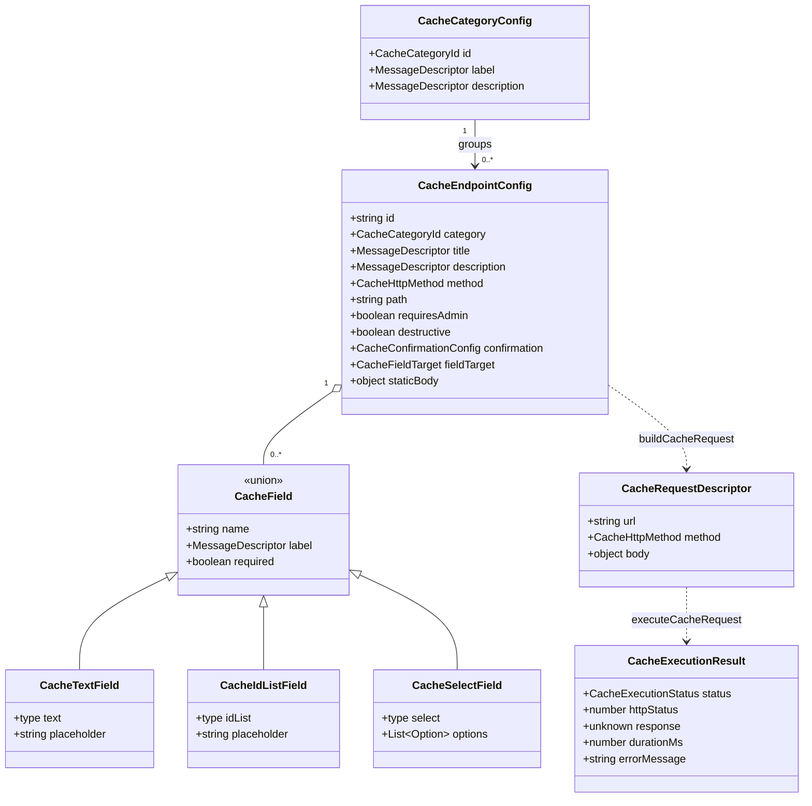

`CacheField` is a discriminated union on `type` — the form and the request builder both
switch on it exhaustively, so adding a variant surfaces as a type error at every site
that must handle it.

---

## 11. Adding an endpoint

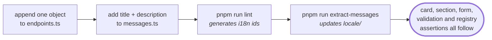

No component is edited and no test is written. The registry test automatically asserts
the new entry has a unique id, a known category, confirmation copy if it is destructive,
and no body on a `GET`/`DELETE`.

The one change that does touch components is a **new field type**: extend the
`CacheField` union, add a branch in `CachePayloadForm`, handle it in
`buildCacheRequest`. Three files, each flagged by the compiler.

---

## 12. Navigation

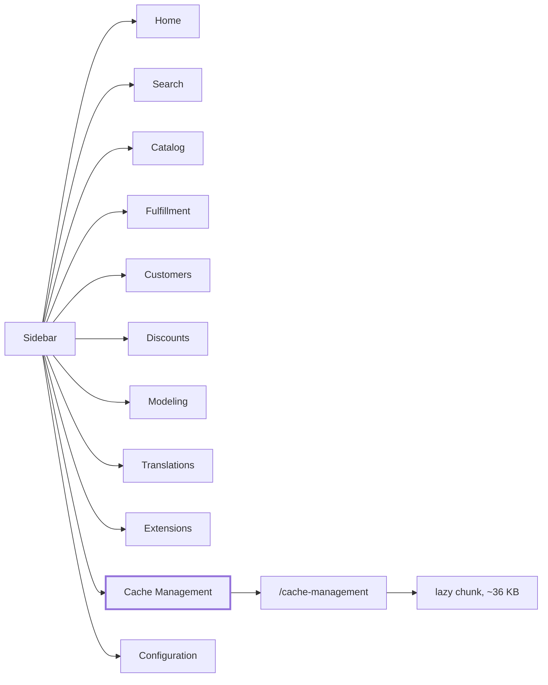

Lazy-loaded, so the module costs nothing to users who never open it.
