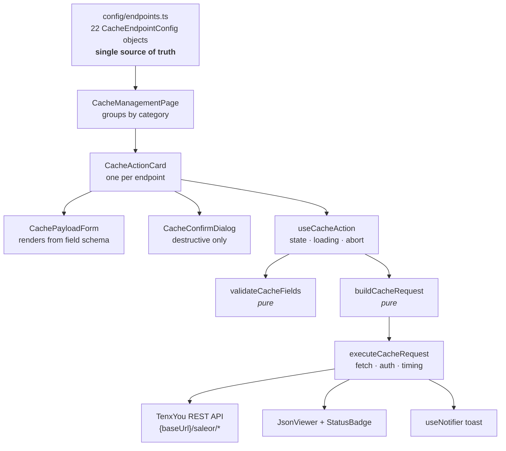
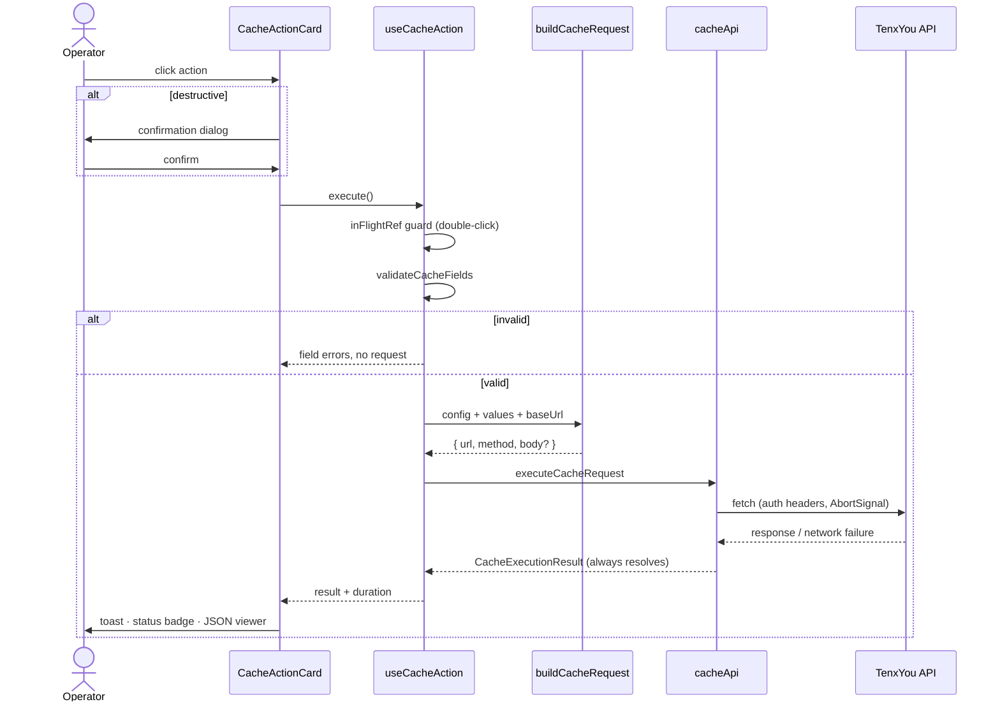
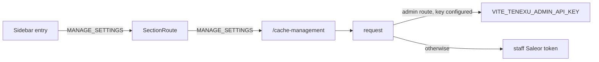

# Cache Management Dashboard — High Level Design

**Status:** Implemented · **Module:** `src/cacheManagement/` · **Route:** `/cache-management`

---

## 1. Problem

Cache invalidation for the TenxYou storefront is driven by ~22 REST endpoints on the
TenxYou backend. Until now the only way to call them was a shared Postman collection.
That has three costs:

- **Access friction.** Only people with the collection and the right environment
  variables can clear a cache. Ops has to ask a developer.
- **No guardrails.** Postman will happily send `{"cache_key_prefix": "preordr"}` — a
  typo that silently clears nothing, or `{"scope": "all"}` against production with no
  second thought.
- **No audit surface.** Nobody can see what was run, whether it succeeded, or how long
  it took without asking in Slack.

## 2. Goals

| Goal                                                           | How it is met                                           |
| -------------------------------------------------------------- | ------------------------------------------------------- |
| Any authorised staff user can clear a cache from the dashboard | Sidebar entry gated on `MANAGE_SETTINGS`                |
| Impossible to send a malformed payload                         | Field schemas + validation + closed enums               |
| Destructive operations require intent                          | Confirmation dialog with per-endpoint blast-radius copy |
| Adding an endpoint is cheap                                    | Declarative registry — one object, no new JSX           |
| Response is visible without dev tools                          | Inline JSON viewer, status badge, timing                |

### Non-goals

- **Persisted audit log.** History/analytics belong on the backend, not in browser
  storage. Deliberately dropped after the first iteration.
- **Scheduling / automation.** This is a manual operator tool.
- **Products & Variant cache routes.** Excluded from scope; the collection's remaining
  admin-gated route is the inventory stock seed.

## 3. Architecture

The module is a thin, three-layer stack over a declarative registry. Data flows one
direction: config → request → response → UI.



### Layer responsibilities

**Config layer** (`config/`, `types.ts`) — pure data. Describes _what_ each endpoint is:
method, path, whether it needs admin auth, whether it is destructive, and what fields it
accepts. Contains no logic and no React.

**Logic layer** (`utils/`, `api/`) — pure functions plus one fetch wrapper.
`buildCacheRequest` turns config + form values into a concrete request;
`validateCacheFields` returns error codes. Both are deterministic and are the primary
unit-test surface.

**UI layer** (`components/`, `hooks/`, `views/`) — React. `useCacheAction` owns
per-card state; components are generic over the config and contain no
endpoint-specific branching.

### Why REST and not Apollo

These endpoints live on the TenxYou backend, not the Saleor GraphQL API. The service
layer is plain `fetch`, mirroring the existing precedent in
[`src/orders/api/bulkOrderApi.ts`](../src/orders/api/bulkOrderApi.ts) and
`src/returns-exchange/api/manualExchangeApi.ts`. Routing them through Apollo would mean
inventing a fake GraphQL surface for no benefit.

## 4. Core type

Everything the UI does is derived from this shape. Adding an endpoint means appending
one object to the registry — no component changes, no new test.

```ts
interface CacheEndpointConfig {
  id: string;
  category: CacheCategoryId; // which section it renders under
  title: MessageDescriptor; // i18n, not raw strings
  description: MessageDescriptor;
  method: "GET" | "POST" | "DELETE";
  path: string; // "/saleor/clear-cache"
  requiresAdmin?: boolean; // swap bearer for the admin key
  destructive?: boolean; // red card + forced confirmation
  confirmation?: { title; description };
  fields?: CacheField[]; // renders the form
  fieldTarget?: "body" | "query"; // where field values land
  staticBody?: Record<string, unknown>; // pinned payload, e.g. { scope: "all" }
  actionLabel?: MessageDescriptor;
}
```

`CacheField` is a discriminated union of three input kinds:

| Type     | Renders      | Emits                              |
| -------- | ------------ | ---------------------------------- |
| `text`   | `<Input>`    | trimmed string                     |
| `idList` | `<Textarea>` | `string[]`, split on newline/comma |
| `select` | `<Select>`   | one value from a closed option set |

The `staticBody` + `fields` split is what lets the Rating endpoints share one path:
the card pins `scope` while the operator supplies only `order_ids`.

## 5. Request flow



### Key behaviours

- **`executeCacheRequest` never rejects.** A network failure returns
  `{ status: "error", httpStatus: 0 }`. Timing, toasts and rendering therefore have
  exactly one code path instead of a try/catch fork.
- **Double-submit is guarded twice** — the `loading` state disables the button, and an
  `inFlightRef` catches two clicks dispatched inside the same React batch, which
  `loading` alone can lose.
- **Requests abort on unmount.** `useCacheAction` holds an `AbortController` and a
  `mountedRef`, so navigating away mid-request cannot set state on a dead component.
- **Bodies are omitted when empty.** Several endpoints expect a bare POST with no
  `Content-Type`; the builder only attaches a body when there is something to send, and
  never on `GET`/`DELETE`.

## 6. Endpoint inventory

Nine sections, 22 cards. PDP/PLP is ordered first because it is the most frequently run.

| Section           | Cards | Payload                      | Notes                                   |
| ----------------- | ----- | ---------------------------- | --------------------------------------- |
| PDP / PLP slugs   | 3     | none                         | `GET`, one-click                        |
| Inventory / stock | 2     | none · `variantIds[]`        | **admin key**; full seed is destructive |
| Generic cache     | 5     | pinned prefix · select       | closed allow-list only                  |
| Navbar            | 1     | none                         |                                         |
| Testimonial       | 2     | none · `productId` **query** |                                         |
| Thank you page    | 3     | none · pinned prefix         |                                         |
| Rating            | 4     | pinned scope · `order_ids[]` | `scope: all` is the emergency reset     |
| Exchange reasons  | 1     | none                         |                                         |
| Taggbox           | 1     | 3 **query** params           | only `DELETE` in the set                |

Three payload shapes exist and the abstraction covers all of them from day one:
JSON body, query string, and no payload. Two endpoints (`clear-testimonial-cache`,
`tagbox-data`) use query params — had the form layer assumed JSON bodies, both would
have needed a retrofit.

### The generic prefix is a closed enum

`/clear-cache` accepts any string server-side. The dashboard exposes exactly four
values — `cache:freebie`, `taggbox:`, `preorder`, `edd-config` — as four dedicated
cards plus one select-driven advanced card. **There is no free-text path to this
endpoint.** A mistyped prefix returns HTTP 200 having cleared nothing, which is the
worst possible failure mode: silent and indistinguishable from success.

## 7. Security & authorisation



- **Permission gate is applied twice** — on the sidebar item and on the route — so
  deep-linking to `/cache-management` without `MANAGE_SETTINGS` fails the same way as
  not seeing the menu entry.
- **Auth follows repo precedent.** Requests carry the signed-in staff user's Saleor
  bearer token plus `X-Refresh-Token`. The one admin-flagged route
  (`/inventory-stock-cache-init`) uses `VITE_TENEXU_ADMIN_API_KEY` _if configured_, and
  otherwise falls back to the staff token so the backend enforces the permission itself.
- **No secret is committed.** `.env.template` ships the key as an empty value with a
  comment; only `.env` (git-ignored) holds a real one.
- **Client-side gating is convenience, not enforcement.** The backend remains the
  authority on every one of these routes.

## 8. Validation & error handling

**Validation** is a pure function returning error _codes_, not strings:

```ts
validateCacheFields({ endpoint, values }) → { variantIds: "emptyList" }
```

Codes resolve to messages through `react-intl` at render time. This keeps the logic
translation-agnostic and directly assertable in tests.

**Errors** are normalised into one shape at the API boundary:

| Failure                       | `httpStatus` | Surfaced as                                          |
| ----------------------------- | ------------ | ---------------------------------------------------- |
| Validation                    | —            | inline field helper text, no request sent            |
| HTTP 4xx/5xx                  | actual       | red badge + `error`/`message`/`detail` from the body |
| Network / CORS                | `0`          | red badge + exception message                        |
| Missing `VITE_TENEXU_API_URL` | —            | card disabled with an explanatory line               |

The last case matters: without it, an unconfigured environment produces buttons that
appear functional and fail silently.

## 9. Navigation & permissions

```
Sidebar
 ├── Home · Search · Catalog · Fulfillment · Customers
 ├── Discounts · Modeling · Translations · Extensions
 ├── 🗲 Cache Management   ← MANAGE_SETTINGS   →  /cache-management
 └── ⚙ Configuration
```

Registered as a lazy-loaded `SectionRoute` in `src/index.tsx`, so the module ships as
its own ~36 KB chunk and costs nothing to users who never open it.

## 10. Testing

24 tests across 3 suites, aimed at the pure layers where bugs are cheap to catch:

| Suite                  | Covers                                                                                          |
| ---------------------- | ----------------------------------------------------------------------------------------------- |
| `buildRequest.test.ts` | id parsing, body vs query routing, `staticBody` merge, URL normalisation, no-body-on-GET/DELETE |
| `validation.test.ts`   | required fields, empty lists, multi-field reporting, initial values                             |
| `endpoints.test.ts`    | registry invariants                                                                             |

The registry test is the load-bearing one. It asserts that ids are unique, every
category resolves, **every destructive endpoint has confirmation copy**, only the
inventory routes are admin-flagged, the prefix enum matches the allow-list exactly, and
no `GET`/`DELETE` carries a body. A future endpoint added carelessly fails CI rather
than shipping without a confirmation dialog.

Components are covered by Storybook stories rather than render tests — they hold no
logic worth asserting beyond what the config drives.

## 11. Extensibility

Adding an endpoint:

```ts
{
  id: "clear-banner-cache",
  category: "generic",
  title: cacheEndpointMessages.bannerClear,
  description: cacheEndpointMessages.bannerClearDescription,
  method: "POST",
  path: "/saleor/clear-banner-cache",
}
```

Then run `pnpm run lint` (generates the i18n id) and `pnpm run extract-messages`. The
card, its section placement, its form, its validation and its registry assertions all
follow automatically.

Adding a **new field type** is the only change that touches components: extend the
`CacheField` union, add a branch in `CachePayloadForm`, and handle it in
`buildCacheRequest`. Three files, all of them obvious.

## 12. Configuration

| Variable                    | Required | Purpose                                                                 |
| --------------------------- | -------- | ----------------------------------------------------------------------- |
| `VITE_TENEXU_API_URL`       | yes      | TenxYou API origin, no trailing path — the module appends `/saleor/...` |
| `VITE_TENEXU_ADMIN_API_KEY` | no       | Bearer key for admin-flagged routes; falls back to the staff token      |

Environments: `http://localhost:4567` · `https://api.tenxyou.infinitelocus.com` ·
`https://api.tenxyou.com`

## 13. Risks & future work

- **No server-side audit trail.** The dashboard shows the operator their own result and
  nothing else. If "who cleared production at 3am" becomes a real question, it should be
  answered by backend logging, not by reinstating browser-local history.
- **Long-running operations block their card.** The full inventory seed can take
  minutes and holds an open request. If the backend grows an async job API, the seed
  cards should move to submit-and-poll.
- **Trusts the response shape loosely.** Error extraction probes `error`, `message` and
  `detail`; an endpoint returning something else shows a generic status line. Acceptable
  because the raw JSON is always displayed.
- **The registry can drift from the backend.** It mirrors a Postman collection, which is
  itself a manual artefact. Endpoint changes must be mirrored here by hand.

## 14. File map

```
src/cacheManagement/
├── index.tsx                    section route
├── urls.ts · types.ts · messages.ts
├── config/
│   ├── endpoints.ts             ← the registry (22 objects)
│   ├── categories.ts            section order + copy
│   └── endpoints.test.ts        registry invariants
├── api/cacheApi.ts              fetch, auth, timing, error normalisation
├── utils/
│   ├── buildRequest.ts          config + values → request   (+ test)
│   └── validation.ts            field schema → error codes  (+ test)
├── hooks/useCacheAction.ts      per-card state machine
├── components/
│   ├── CacheManagementPage/     layout, sections
│   ├── CacheActionCard/         one endpoint
│   ├── CachePayloadForm/        schema-driven inputs
│   ├── CacheConfirmDialog/      destructive gate
│   ├── JsonViewer/              response + copy
│   └── ExecutionStatusBadge/    success/failure + duration
└── views/CacheManagementView.tsx
```

Touch points outside the module: `src/index.tsx` (route),
`src/components/Sidebar/menu/hooks/useMenuStructure.tsx` (nav), `src/intl.ts`
(section name), `src/vite-env.d.ts` and `.env.template` (config).
